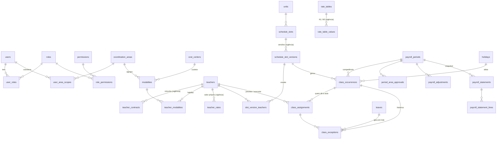

# 02 · Banco de dados — modelo e relacionamentos

PostgreSQL 16. Convenções para **todas** as tabelas de negócio:

- `id uuid pk default gen_random_uuid()`
- `created_at`, `updated_at timestamptz`, `created_by uuid → users`
- `deleted_at timestamptz null` **só** em cadastros (soft delete)
- Datas de aula: `date`; horários: `time` — fuso da Nação implícito
  (America/Sao_Paulo). Nada de `timestamptz` na escala: 05:00 é 05:00,
  com ou sem horário de verão.
- **Tempo em minutos inteiros** (`int`). **Dinheiro em centavos** (`bigint`).
  Nunca `float`.
- Vigências como `valid_from date not null`, `valid_to date null`
  (inclusivo; `null` = em aberto) + **exclusion constraint** com
  `daterange` para impedir sobreposição.

---

## 1. Diagrama

---

## 2. Identidade e acesso

| Tabela | Campos-chave | Notas |
|---|---|---|
| `users` | `auth_user_id` (Supabase), `name`, `email`, `active`, `teacher_id?` | `teacher_id` liga o usuário ao próprio cadastro (portal do professor, Fase 2) |
| `roles` | `key`, `name`, `is_system` | ADMIN, COORDENADOR, CONSULTA, PROFESSOR |
| `permissions` | `key` (`payroll.close`…) | Catálogo fixo, versionado em migration |
| `role_permissions` | `role_id`, `permission_id` | |
| `user_roles` | `user_id`, `role_id` | |
| `user_area_scopes` | `user_id`, `area_id`, `can_view_finance` | Vazio para ADMIN = tudo |

## 3. Catálogos parametrizáveis (nada hard-coded)

| Tabela | Campos-chave | Notas |
|---|---|---|
| `units` | `name`, `active` | Hoje uma unidade; pronto para mais |
| `coordination_areas` | `name`, `color` | "Cross & HYROX", "Lutas", "Raquetes", "Kids"… |
| `cost_centers` | `code`, `name`, `active` | |
| `modalities` | `name`, `slug`, `color`, `icon`, `area_id`, `cost_center_id`, `requires_confirmation bool`, `default_duration_min`, `active` | `requires_confirmation` liga a confirmação manual só onde precisa |
| `activity_types` | `name`, `kind` (AULA/PLANTAO/COORDENACAO/REUNIAO/CURSO/EVENTO/PERSONAL), `counts_hours bool` | Nem toda hora é aula. O briefing chamava de `class_types` |
| `spaces` | `name` (CROSSFIT 1, SALA TATAME, QUADRA 6, Sala de musculação…), `unit_id` | Sala/quadra: é como a grade atual é organizada |
| `cancellation_reasons` | `name`, `counts_teacher_hours bool`, `requires_note bool`, `active` | Chuva, sem alunos, espaço indisponível… |
| `settings` | `period_start_day` (padrão **26**), `timezone` | Competência 26→25 parametrizável |
| `positions` (cargos) | `name` | Professor, Instrutor, Estagiário, Coordenador… |
| `teacher_levels` | `code` (N1…N5), `order` | |
| `contract_types` | `code` (CLT, MEI_PJ, ESTAGIO, HORISTA…), `name`, `dsr_applies bool` | |

## 4. Professores

| Tabela | Campos-chave | Notas |
|---|---|---|
| `teachers` | `name`, `photo_path`, `cpf?` (cifrado), `phone`, `email`, `admission_date`, `termination_date?`, `status`, `primary_modality_id`, `position_id`, `level_id`, `coordinator_user_id?`, `default_weekly_minutes`, `notes` | Nível e cargo "atuais" por conveniência de UI; histórico em `teacher_contracts` |
| `teacher_contracts` | `teacher_id`, `contract_type_id`, `level_id`, `position_id`, `cost_center_id?`, `valid_from`, `valid_to` | Vigência — **o nível usado na folha de agosto é o de agosto** |
| `teacher_modalities` | `teacher_id`, `modality_id`, `is_primary` | Habilitação: alimenta o autocomplete de substitutos |
| `teacher_aliases` | `teacher_id`, `alias`, `modality_id?` | Só para a importação: "Fulana (mobility)" → Fulana + Mobilidade; "Fulanaa" → Fulana. Depois disso tudo é ID |

## 5. Grade padrão (CAMADA 1)

A peça central do versionamento.

| Tabela | Campos-chave | Notas |
|---|---|---|
| `schedule_slots` | `unit_id`, `label?` | **Identidade** estável de "a aula de segunda 05:00 de HYROX". Não muda |
| `schedule_slot_versions` | `slot_id`, `weekday (1=seg…7=dom)`, `start_time`, `duration_min`, `modality_id`, `activity_type_id`, `space_id?`, `label?` (turma: "Série A", "Master"), `valid_from`, `valid_to`, `change_reason` | **O que** a aula é, **a partir de quando**. Exclusion constraint: um slot não tem duas versões no mesmo dia |
| `slot_version_teachers` | `slot_version_id`, `teacher_id`, `role` (TITULAR/AUXILIAR/ESTAGIARIO), `duration_min?` | Aula com várias pessoas é rotina (auxiliar no CrossFit, professor + estagiário no plantão). **Cada uma recebe a duração cheia** |

"Alterar grade a partir de 15/10" = `UPDATE versão atual SET valid_to = 14/10`
+ `INSERT nova versão valid_from = 15/10`. A versão antiga continua lá,
e as ocorrências de 01–14/10 continuam apontando para ela.

A `weekly_schedules` / `schedule_versions` do briefing correspondem a
`schedule_slots` / `schedule_slot_versions`.

## 6. Ocorrências e exceções (CAMADAS 2 e 3)

| Tabela | Campos-chave | Notas |
|---|---|---|
| `class_occurrences` | `period_id`, `date`, `origin` (GRADE/EXTRA), `slot_version_id?`, `modality_id`, `activity_type_id`, `space_id?`, `label?`, `cancellation_reason_id?`, `start_time`, `duration_min`, `planned_start_time`, `planned_duration_min`, `status`, `holiday_id?`, `needs_review bool` | **Unique `(slot_version_id, date)`** → gerar o mês duas vezes não duplica nada. `planned_*` congela o que a grade dizia; os campos "vivos" refletem exceções |
| `class_assignments` | `occurrence_id`, `role`, `planned_teacher_id?`, `executing_teacher_id?`, `minutes`, `status`, `absence_reason?`, `confirmed_at?`, `confirmed_by?` | **A unidade de pagamento.** Uma linha por "cadeira de professor" na aula. `planned_teacher_id` null ⇒ aula extra |
| `class_exceptions` | `occurrence_id`, `assignment_id?`, `type`, `reason`, `notes`, `leave_id?`, `before jsonb`, `after jsonb`, `created_by`, `created_at`, `reverted_by_exception_id?` | **Append-only.** Nunca `UPDATE`, nunca `DELETE` (trigger bloqueia). Desfazer = nova exceção tipo `REVERSAO` |
| `leaves` | `teacher_id`, `type` (FERIAS/ATESTADO/AFASTAMENTO/FOLGA), `start_date`, `end_date`, `default_coverage` (PENDENTE/CANCELAR), `notes` | Aplicada às ocorrências existentes **e** às que forem geradas depois |
| `holidays` | `date`, `name`, `scope` (NACIONAL/DISTRITAL/NACAO), `policy` (CANCELAR_TODAS/MANTER_TODAS/DECIDIR_INDIVIDUALMENTE), `unit_id?` | Pré-carregados nacionais + DF; Nação cadastra os seus |
| `holiday_modality_policies` | `holiday_id`, `modality_id`, `policy` | Opcional: "no Natal cancela tudo exceto Nação Fit" |

`substitutions` do briefing é uma **view** sobre `class_exceptions`
(`type = SUBSTITUICAO`) — uma fonte de verdade só.

### Status

`class_assignments.status`:
`PREVISTA · REALIZADA · SUBSTITUIDA · CANCELADA · AUSENTE_PENDENTE`
(+ `absence_reason`: FALTA · FERIAS · ATESTADO · FOLGA · OUTRO)

`class_occurrences.status` (agregado para a UI):
`PREVISTA · REALIZADA · COM_ALTERACAO · CANCELADA · PENDENTE_PROFESSOR ·
AGUARDANDO_DECISAO_FERIADO · AGUARDANDO_CONFIRMACAO`

## 7. Fechamento

| Tabela | Campos-chave | Notas |
|---|---|---|
| `payroll_periods` | `year`, `month` (mês em que termina), **`start_date`, `end_date`** (26/08–25/09), `status`, `generated_at`, `closed_at`, `closed_by`, `needs_review`, `input_hash` | Unique `(year, month)`. Exclusion constraint: períodos não se sobrepõem. A ocorrência cai no período cujo intervalo contém a data. Máquina de estados em [03](03-regras-de-negocio.md#6-fechamento-mensal) |
| `period_area_approvals` | `period_id`, `area_id`, `status`, `approved_by`, `approved_at`, `notes` | Uma aprovação por área de coordenação |
| `approvals_history` | `period_id`, `area_id?`, `from_status`, `to_status`, `user_id`, `at`, `comment` | O briefing chama de `approvals`; toda transição fica aqui |
| `payroll_adjustments` | `period_id` (onde entra), `teacher_id`, `modality_id?`, `origin_period_id` (competência de origem), `minutes` (±), `amount_cents?` (±), `reason`, `notes`, `created_by` | "−2h referente a agosto" |
| `minute_adjustments` | `period_id`, `teacher_id`, `occurrence_id?`, `minutes` (±), `type` (COMPENSACAO/OUTRO), `reason` | Compensações dentro do próprio mês |
| `payroll_statements` | `period_id`, `teacher_id`, `version`, `totals jsonb`, `snapshot_at`, `is_current` | **Snapshot imutável** no fechamento. Reabrir cria `version+1` |
| `payroll_statement_lines` | `statement_id`, `modality_id`, `cost_center_id`, `kind` (PROPRIA/SUBSTITUICAO/EXTRA/AJUSTE/COMPENSACAO), `minutes`, `rate_cents?`, `amount_cents?`, `rule_trace jsonb` | `rule_trace` explica o valor: "N3 CrossFit R$ X/h + 20% domingo" |

## 8. Financeiro (separado do operacional, **Fase 2**)

Tabelas criadas desde o início, sem tela nem cálculo no MVP.

| Tabela | Campos-chave | Notas |
|---|---|---|
| `rate_tables` | `name` ("Tabela Níveis 2026") | |
| `rate_table_values` | `rate_table_id`, `level_id`, `modality_id?`, `activity_type_id?`, `hourly_cents`, `valid_from`, `valid_to` | `modality_id` null = vale para todas |
| `teacher_rates` | `teacher_id`, `modality_id?`, `activity_type_id?`, `hourly_cents`, `valid_from`, `valid_to` | Override individual. Precedência em [03](03-regras-de-negocio.md#7-motor-financeiro) |
| `pay_rules` | `name`, `kind` (ADICIONAL_PCT/ADICIONAL_FIXO_HORA/GRATIFICACAO_FIXA/DESCONTO; DSR fica com a contabilidade), `value`, `conditions jsonb` (weekday, is_holiday, modality_ids, contract_type_ids, teacher_ids, position_ids), `priority`, `valid_from`, `valid_to`, `active` | Motor de regras declarativo, sem código novo por regra |

## 9. Auditoria, notificações, integrações

| Tabela | Campos-chave |
|---|---|
| `audit_logs` | `at`, `user_id`, `ip`, `user_agent`, `action`, `entity_type`, `entity_id`, `before jsonb`, `after jsonb`, `period_id?`, `summary` (texto humano: "alterou professor da aula HYROX de Eliseu para João") |
| `notifications` | `user_id`, `kind`, `title`, `body`, `link`, `dedupe_key`, `read_at` |
| `external_ids` | `entity_type`, `entity_id`, `system`, `external_id` — unique `(system, entity_type, external_id)` |
| `domain_events` | `type`, `payload`, `occurred_at`, `dispatched_at?`, `attempts` |
| `webhook_subscriptions` / `webhook_deliveries` | URL, segredo (cifrado), eventos; log de entrega |
| `api_tokens` | `name`, `token_hash`, `scopes`, `last_used_at`, `revoked_at` |
| `import_batches` / `import_rows` | arquivo, layout detectado (CrossFit / Quadras / Nação Fit / Contraturno / genérico), mapeamento, status por linha, erros |

`audit_logs` e `class_exceptions`: `REVOKE UPDATE, DELETE` + trigger que
levanta erro. Nem o admin apaga história.

---

## 10. Índices que importam

| Índice | Atende |
|---|---|
| `class_occurrences (period_id, date)` | Calendário da competência, geração |
| `class_occurrences (date, start_time)` | "Aulas de hoje" / "próxima semana" |
| `class_occurrences (status) where status in ('PENDENTE_PROFESSOR','AGUARDANDO_DECISAO_FERIADO')` (parcial) | Tela de pendências, instantânea |
| `class_assignments (executing_teacher_id, occurrence_id)` e `(planned_teacher_id, occurrence_id)` | Extrato do professor, férias em lote |
| `class_exceptions (occurrence_id, created_at)` | Linha do tempo da aula |
| `schedule_slot_versions using gist (slot_id, daterange(valid_from, valid_to, '[]'))` | Exclusion constraint de vigência |
| `teacher_rates` / `rate_table_values` gist por vigência | Resolução de valor por data |
| `audit_logs (entity_type, entity_id, at desc)` e `(at desc)` | Histórico por registro e geral |

## 11. Constraints de negócio no banco

- `duration_min > 0 and duration_min <= 600`
- `leaves.end_date >= start_date`
- `class_assignments`: `executing_teacher_id` obrigatório quando
  `status in (REALIZADA, SUBSTITUIDA)`
- `payroll_adjustments.origin_period_id <> period_id`
- Sem sobreposição de vigência (exclusion) em versões de grade, contratos e
  valores.
- Trigger de competência fechada (ver [01 §4.4](01-produto-e-arquitetura.md#44-defesa-em-profundidade)).
